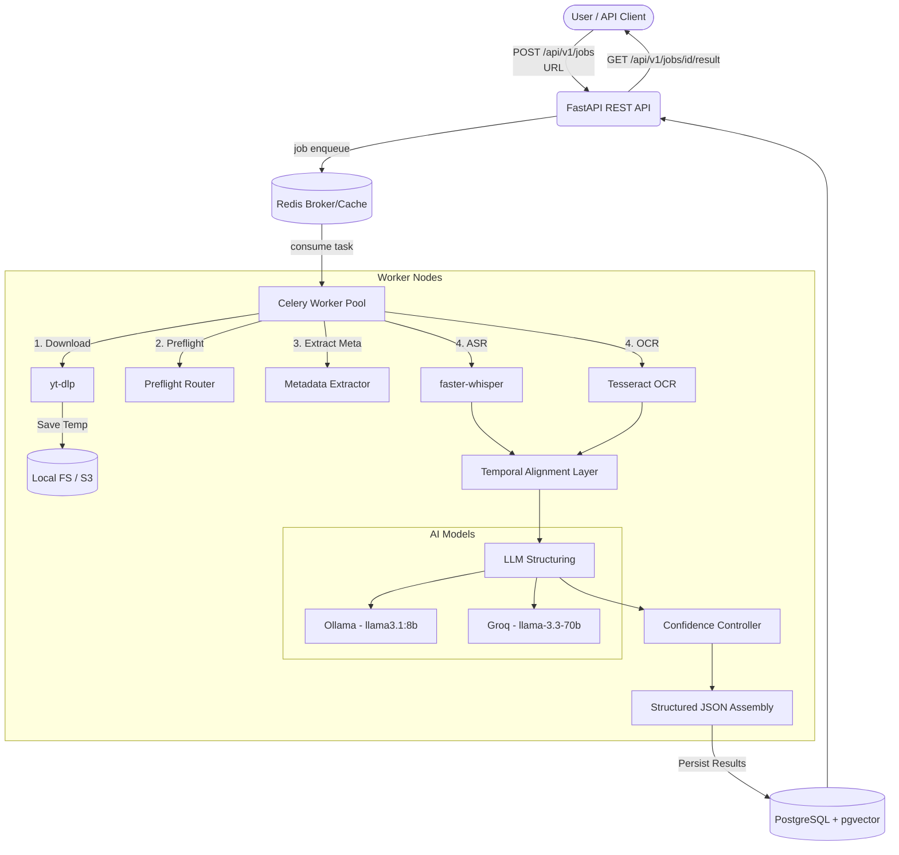
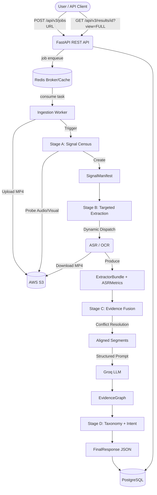

# ytclfr - System Architecture

ytclfr is a robust, distributed video intelligence pipeline designed to ingest YouTube videos and extract structured, meaningful content (spoken words, on-screen text, temporal context) and classify video intents.

## 1. High-Level Data Flow

The following diagram illustrates the lifecycle of a video processing job through the system (V1/V2 Flow).

## 2. Core Components

### 2.1 API Layer (FastAPI)
- **Role:** Ingests URLs, returns job IDs, provides job status polling, and serves final structured JSON.
- **Auth:** Secured via JWT (JSON Web Tokens).
- **Validation:** Pydantic v2 schemas ensure strict runtime validation and automatic OpenAPI documentation generation.

### 2.2 Task Queue & Workers (Celery & Redis)
- **Role:** Handles asynchronous processing of long-running video extraction tasks.
- **Topology:** Designed for heterogeneous distributed deployment (e.g., separate ingest workers, heavy ML workers for ASR/OCR, fast workers for quick metadata).
- **Broker/Backend:** Redis 7 acts as both the Celery message broker and a fast cache for temporary states.

### 2.3 Storage Layer
- **Relational DB:** PostgreSQL 16 (hosted via Supabase) persists job states, metadata, and final structured output.
- **Vector DB:** `pgvector` extension is used natively within Postgres for semantic/vector similarity search using GIN indexes.
- **Temporary Object Storage:** AWS S3 (via `boto3`) is used for distributed media transport between worker nodes. Local filesystems are strictly used for transient scratch storage during task execution.

## 3. Extraction Engines

The pipeline utilizes multiple specialized engines for data extraction:
- **ASR (Speech-to-Text):** `faster-whisper` (model: small, compute: int8, device: cpu) for word-level timestamps.
- **OCR (On-Screen Text):** `Tesseract 5` via `pytesseract` for frame-level text extraction.
- **LLM Structuring (Local):** `Ollama` running `llama3.1:8b` for routine structuring and extraction.
- **LLM Reasoning (Cloud):** `Groq` API running `llama-3.3-70b-versatile` for complex reasoning and taxonomy classification tasks.
- **Embeddings:** `nomic-embed-text` via Ollama for generating vector representations stored in pgvector.

## 4. Pipeline Evolution: V1 → V2 → V3

### V1 Philosophy
In V1, videos undergo a preemptive routing classification, followed by parallel execution of all extractors (ASR, OCR). The results are then combined.

### V2 Philosophy (Evidence-Based Late Binding)
V2 introduces a more efficient, four-stage pipeline designed to prevent premature commitment to expensive extractions:
1. **Stage A (Signal Census):** Cheap physical signal detection (Voice Activity Detection, scene cuts, motion density, metadata). Produces a `SignalManifest`.
2. **Stage B (Targeted Extraction):** Dynamically invokes only the heavy extractors (e.g., OCR, ASR) that are necessary based on the `SignalManifest` from Stage A.
3. **Stage C (Evidence Fusion):** Temporal alignment, entity extraction, and reasoning over the extracted signals using Groq. Introduces conflict resolution logic where inferred structure dictates confidence (e.g., OCR is prioritized for structured layouts, ASR for speech-heavy formats).
4. **Stage D (Taxonomy + Intent):** Final video classification backed by the complete evidence graph. Employs late-binding of structural context where inferred layout (list, ranking) overrides static metadata as a hard structural prior.

## 5. V3 Architecture (Current)

V3 builds upon V2's four-stage pipeline but introduces strict contract isolation (`frozen=True` models), explicit ASR degradation detection, and resource views for the API.

